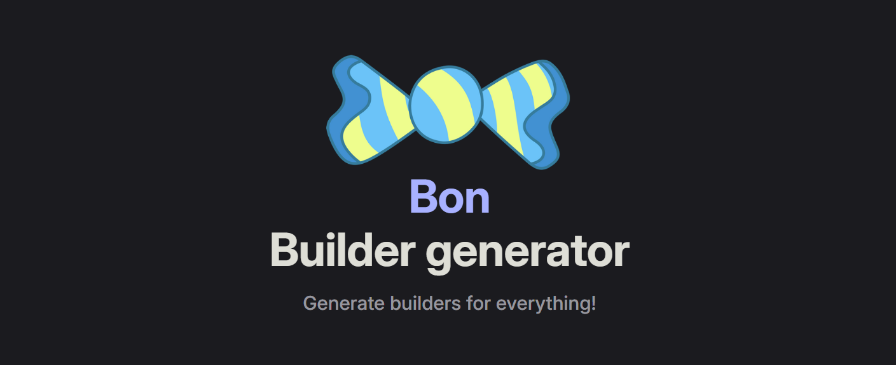

<a href="https://elastio.github.io/bon/docs/guide/overview">

</a>

`bon` is a Rust crate for generating compile-time-checked builders for functions and structs.

Visit the [guide for a complete overview of the crate](https://elastio.github.io/bon/docs/guide/overview).

## Quick example

`bon` can turn a function with positional parameters into a function with "named" parameters via a builder. It's as easy as placing the `#[builder]` macro on top of it.

```rust
use bon::builder;

#[builder]
fn greet(name: &str, age: u32) -> String {
    format!("Hello {name} with age {age}!")
}

let greeting = greet()
    .name("Bon")
    .age(24)
    .call();

assert_eq!(greeting, "Hello Bon with age 24!");
```

See [the guide](https://elastio.github.io/bon/docs/guide/overview) for the rest.

#### License

<sup>
Licensed under either of <a href="LICENSE-APACHE">Apache License, Version
2.0</a> or <a href="LICENSE-MIT">MIT license</a> at your option.
</sup>

<br>

<sub>
Unless you explicitly state otherwise, any contribution intentionally submitted
for inclusion in the work by you, as defined in the Apache-2.0 license, shall be
dual licensed as above, without any additional terms or conditions.
</sub>
